# User Request Flow - Frontend to Backend

This diagram illustrates the complete journey of a user's query through the RAG chatbot system.

## Flow Diagram

```mermaid
sequenceDiagram
    participant User as 👤 User
    participant UI as 🌐 Frontend (Browser)
    participant API as ⚡ FastAPI Backend
    participant RAG as 🧠 RAG System
    participant AI as 🤖 Claude AI
    participant Tool as 🔍 Search Tools
    participant Vector as 📚 Vector Store (ChromaDB)
    participant Session as 📝 Session Manager

    Note over User,Session: Step 1: User Input
    User->>UI: Types query in chat input
    Note right of User: <input id="chatInput"><br/>frontend/index.html:58-71

    Note over User,Session: Step 2: Frontend Processing
    UI->>UI: sendMessage() triggered<br/>(Enter key or Send button)
    Note right of UI: script.js:45-72

    Note over User,Session: Step 3: API Request
    UI->>API: POST /api/query<br/>{query, session_id}
    Note right of UI: Fetch API call<br/>script.js:63-72

    Note over User,Session: Step 4: Backend Entry Point
    API->>API: query_documents()<br/>app.py:56-74
    API->>API: Create/retrieve session ID

    Note over User,Session: Step 5: RAG Processing
    API->>RAG: rag_system.query(query, session_id)<br/>rag_system.py:102-140
    RAG->>Session: Get conversation history

    Note over User,Session: Step 6: AI Generation
    RAG->>AI: generate_response(prompt, tools)<br/>ai_generator.py
    AI->>AI: Build system prompt with history

    Note over User,Session: Step 7: Tool Use (Search)
    AI->>Tool: CourseSearchTool.execute(query)<br/>search_tools.py:52-86
    Tool->>Vector: Semantic search on embeddings<br/>vector_store.py
    Vector-->>Tool: Relevant chunks + metadata
    Tool-->>AI: Search results + sources

    Note over User,Session: Step 8: Response Generation
    AI->>AI: Generate answer with context
    AI-->>RAG: Response with sources

    Note over User,Session: Step 9: History Update
    RAG->>Session: Store conversation turn

    Note over User,Session: Step 10: Return to Frontend
    RAG-->>API: QueryResponse(answer, sources)
    API-->>UI: JSON Response<br/>{answer, sources}

    Note over User,Session: Step 11: Display to User
    UI->>UI: Update chat interface
    UI->>User: Display answer + source cards
```

## Architecture Overview

```mermaid
graph TB
    subgraph "Frontend Layer"
        UI[index.html<br/>📄 HTML Structure]
        JS[script.js<br/>⚙️ Vanilla JS Logic]
        CSS[style.css<br/>🎨 Styling]
    end

    subgraph "Backend Layer - FastAPI"
        APP[app.py<br/>🚪 API Entry Point]
        CORS[CORS Middleware]
        ROUTES[Static File Routes]
    end

    subgraph "RAG Core"
        RAG[rag_system.py<br/>🧠 Orchestrator]
        AI[ai_generator.py<br/>🤖 Claude Integration]
        TOOLS[search_tools.py<br/>🔍 Course Search]
        VECTOR[vector_store.py<br/>📚 ChromaDB]
        SESSION[session_manager.py<br/>📝 Conversation History]
        DOC[document_processor.py<br/>📖 Document Parsing]
    end

    subgraph "External Services"
        CLAUDE[Anthropic Claude API]
        CHROMA[(ChromaDB Storage)]
        DOCS[Course Documents<br/>docs/]
    end

    %% Frontend connections
    UI --> JS
    UI --> CSS
    JS -->|POST /api/query| APP

    %% Backend internal
    APP --> CORS
    APP --> ROUTES
    APP --> RAG

    %% RAG connections
    RAG --> AI
    RAG --> SESSION
    AI --> TOOLS
    AI --> CLAUDE
    TOOLS --> VECTOR
    VECTOR --> CHROMA
    DOC --> VECTOR
    DOCS --> DOC

    %% Styling
    classDef frontend fill:#e1f5fe,stroke:#01579b,stroke-width:2px
    classDef backend fill:#f3e5f5,stroke:#4a148c,stroke-width:2px
    classDef rag fill:#e8f5e9,stroke:#1b5e20,stroke-width:2px
    classDef external fill:#fff3e0,stroke:#e65100,stroke-width:2px

    class UI,JS,CSS frontend
    class APP,CORS,ROUTES backend
    class RAG,AI,TOOLS,VECTOR,SESSION,DOC rag
    class CLAUDE,CHROMA,DOCS external
```

## File Reference Map

| Component | File | Key Lines |
|-----------|------|-----------|
| **User Input** | `frontend/index.html` | 58-71 |
| **Send Handler** | `frontend/script.js` | 27-30, 45-72 |
| **API Call** | `frontend/script.js` | 63-72 |
| **API Endpoint** | `backend/app.py` | 56-74 |
| **RAG Orchestrator** | `backend/rag_system.py` | 102-140 |
| **AI Generator** | `backend/ai_generator.py` | 43+ |
| **Search Tool** | `backend/search_tools.py` | 52-86 |
| **Vector Store** | `backend/vector_store.py` | - |
| **Session Manager** | `backend/session_manager.py` | - |

## Technology Stack

| Layer | Technology | Purpose |
|-------|-----------|---------|
| Frontend | Vanilla JavaScript | Simple, lightweight UI |
| Frontend | HTML5/CSS3 | Structure and styling |
| Backend | FastAPI | High-performance API framework |
| Backend | Uvicorn | ASGI server |
| AI | Anthropic Claude | LLM for response generation |
| Storage | ChromaDB | Vector database for embeddings |
| Docs | Course materials | PDF/text documents for RAG |
